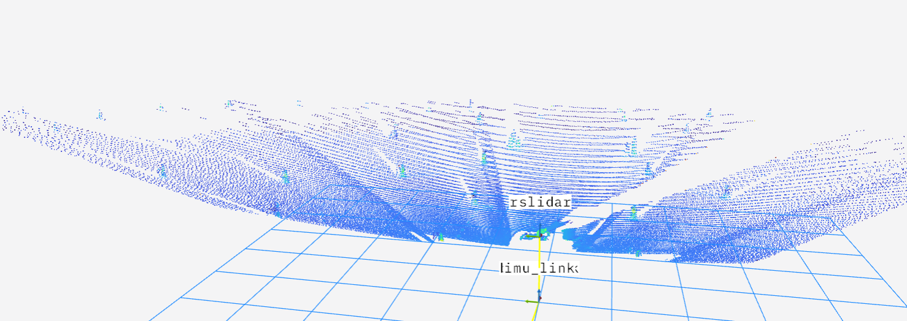
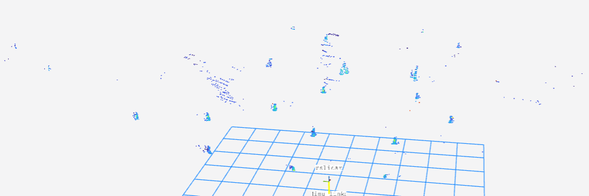
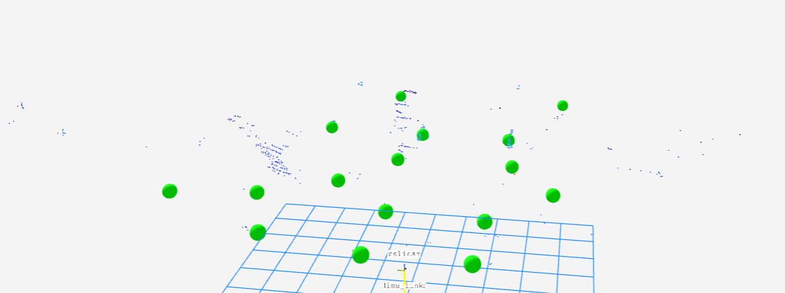

# 3D Cone Detection in LiDAR Point Clouds (WIP)
## Overview

This repository contains code and resources for evaluating preprocessing pipelines and neural network architectures for 3D cone detection in LiDAR point clouds, with a focus on applications in **Formula Student Driverless competitions**.

In these competitions, autonomous race cars navigate tracks outlined by colored traffic cones. Reliable cone detection is essential for **localization, mapping, and path planning**, as well as ensuring the vehicle can safely navigate at high speeds. Key requirements for the perception system include:

* Detecting cone type and relative position to the car
* Robustness under different lighting conditions and racing scenarios
* Low latency (tens of milliseconds) to support real-time processing

## Project Goals

The main objectives of this project are:

1. **Preprocessing LiDAR data:** Implement a pipeline that removes ground points using RANSAC, clusters object proposals with DBSCAN, and reconstructs cones for neural network input.
2. **Fine-tuning PointNet:** Use a pre-trained PointNet backbone to classify clusters as cones (yellow, blue, orange) or non-cones, exploring efficiency and accuracy trade-offs.
3. **Lightweight custom network:** Design a smaller neural network to achieve similar classification performance with reduced computational cost.

## Current state
### Pre-processing pipeline
The pre-processing pipeline is implemented. It includes the following steps.
1. Filter the air points and the points that correspond to the car
2. Segment the pointcloud in a grid of 64x64
3. RANSAC ground removal
4. DBSCAN clustering
5. Reconstruct the cones

A visual of the steps and the succes. A picture of the initial point-cloud:  
<br> </br>

<br> </br>
A picture of the ground removal:
<br> </br>

<br> </br>
A picture of the proposal centroids
<br></br>

<br></br>
## Create rosbridge from WSL to Foxglove on Windows
Download the rosbridge using the following command
```bash
sudo apt install -y ros-humble-foxglove-bridge
```

Run the rosbridge
```bash
ros2 launch foxglove_bridge foxglove_bridge_launch.xml port:=8765
```

Open the rosbridge under connection on foxglove.
