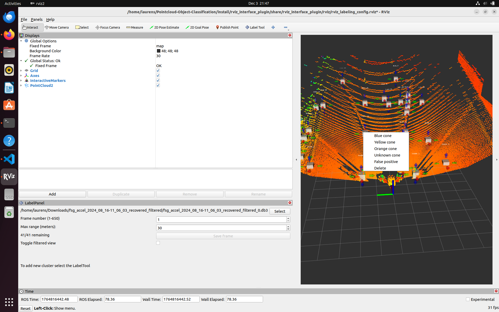

# 3D Cone Detection in LiDAR Point Clouds (WIP)
## Overview

This repository contains code and resources for evaluating preprocessing pipelines and neural network architectures for 3D cone detection in LiDAR point clouds, with a focus on applications in **Formula Student Driverless competitions**.

In these competitions, autonomous race cars navigate tracks outlined by colored traffic cones. Reliable cone detection is essential for **localization, mapping, and path planning**, as well as ensuring the vehicle can safely navigate at high speeds. 

For more background information [jump to the Background section](#background)
## Project Goals

The main objectives of this project are:

1. **Preprocessing LiDAR data:** Implement a pipeline that removes ground points using RANSAC, clusters object proposals with DBSCAN, and reconstructs cones for neural network input.
2. **Custom Labelling Tool**: Implement custom labelling tool to quickly generate training data. 
2. **Fine-tuning PointNet:** Use a pre-trained PointNet backbone to classify clusters as cones (yellow, blue, orange) or non-cones, exploring efficiency and accuracy trade-offs.

## Current state
### Pre-processing pipeline
The pre-processing pipeline is implemented. It includes the following steps.
1. Filter the air points and the points that correspond to the car
2. Segment the pointcloud in a grid of 64x64
3. RANSAC ground removal
4. DBSCAN clustering
5. Reconstruct the cones

A visual of the steps and the succes. A picture of the initial point-cloud:  
<br> </br>

<br> </br>
A picture of the ground removal:
<br> </br>

<br> </br>
A picture of the proposal centroids
<br></br>

<br></br>
## Create rosbridge from WSL to Foxglove on Windows
Download the rosbridge using the following command
```bash
sudo apt install -y ros-humble-foxglove-bridge
```

Run the rosbridge
```bash
ros2 launch foxglove_bridge foxglove_bridge_launch.xml port:=8765
```

Open the rosbridge under connection on foxglove.
### Custom Labelling tool
The custom Labelling tool is implemented. It allows you to load in a db3 file with a Lidar pointcloud publishing on the topic `/rslidar_points`. It takes these points and forwards it to the pre-processing pipeline. The pre-processing pipeline produces proposal clusters and sends it back to the labelling tool using a ros2 service. In the labelling tool you can annotate each proposal with the classes: False Positive, Yellow Cone, Blue Cone, Orange Cone. Below you can find a picture of the labelling tool.
<br></br>

<br></br>
In the data folder you can find the annotated cones. In total, I labelled 15 acceleration frames and 62 skidpad frames which resulted in a total of 2154 labelled cone proposals all annotated from scratch. For more data exploration look at the `exploration.ipynb` notebook in the data folder.

#### Running the tool
In order to run the tool, start by building all the ros2 packages.\
```colcon build``` \
After building the packages, source the install folder by running \
```source install/setup.bash```
In one terminal run: `ros2 launch rviz_interface_pluging labeling_tool.launch.py` and in another run `ros2 run labeling_assist labeling_assist`.

If you already have a `.db3` file you can skip this step. If you just have a `.mcap` file run the following: `source ./data/utils/mcap_to_db3_converter.sh /path/to/mcap_file`.

When the tool is launched, press the load button and navigate to your db3 file. Select a frame, and watch the proposals come up. Make sure to annotate all cones before switching scenes and press save.

## Model


## Background
The Formula Student Competitions task student teams to design, manufacture, and compete with single-seater, open-wheel race cars. Starting in 2018, the driverless category has been added. In this category autonomous race cars such as shown in the picture below, navigate tracks outlined by colored traffic cones. I have quite some experience with this competition as I spent a full-time year as Chief Embedded & Driverless Software at Formula Student Team Delft. The picture below is actually from the car competing in the biggest competition where we got third place overall. 
<br></br>

<br></br>
The competition consists of four dynamic events: Acceleration, a straight line sprint; Skidpad, a figure eight to test cornering ability; Autocross, a single lap on an unknown track; and Trackdrive, a ten-lap endurance run on an unknown track. A visualization of the events can be found in Figure 1 below. The cones (blue on the left and yellow on the right) mark the boundaries of the track, with small orange cones indicating braking zones and big orange cones indicating start/finish lines. The cones have a predefined size and can be viewed in Figure 2 below.
<p align="center">
  
  
  
</p>
<p align="center"><em>Figure 1: Acceleration - skidpad - Autocross and Trackdrive event.</em></p>
<p align="center">
    
</p>
<p align="center"><em>Figure 2: The cones marking the track</em></p>

Cones provide crucial reference points that enable the vehicle to estimate its position
and generate a map of the track when navigating an unknown track. For reliable Simultaneous Localization and Mapping (SLAM) or localization using a known track
map, the computer vision pipeline of a Formula Student Driverless vehicle must detect
the cones, estimate their relative position to the car, and in some approaches also deter-
mine their color. The requirement to determine the color of the cone depends on the
SLAM and path planning approach. A final consideration is the latency and detection
distance. We can estimate the minimum detection range by $ddetection = vmax ·tlookahead =
vmax · N · dt = 15 m
s · 40 · 50 ms = 30 m $. To ensure that the perception system enables
optimal performance of subsequent pipeline stages, its latency should remain below
50ms. This is primarily because SLAM and state estimation performance degrade as
latency increases. Summarized, the requirements for the system are as follows:
1. Detect the type of cone and their relative position to the car
2. The system should be able to handle car racing.
3. The system should be able to deal with different light conditions.
4. The runtime of the system should be in the order of 10’s of ms.
